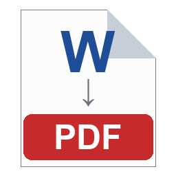

# DOCX to PDF Converter

A simple Windows utility to convert Microsoft Word documents (.docx, .doc) to PDF with pixel-perfect formatting fidelity using Word's native export.

## Requirements

- **Windows** (Windows 10 or later)
- **Microsoft Word** (must be installed; Home, Pro, or Microsoft 365 versions all work)

## Download

**[⬇ Download DocxToPdf.exe](https://github.com/jmitchell238/docx-to-pdf/releases/latest/download/DocxToPdf.exe)** — the latest release. Download it and run it. No installation, no Python required.

Microsoft Word must still be installed, since Word is what performs the conversion (see [Requirements](#requirements) above).

Optionally, right-click the downloaded `DocxToPdf.exe` and choose **Send to → Desktop (create shortcut)** to get a Desktop launcher with its own icon.

**Note:** The first launch takes a second or two while the single-file executable unpacks to a temporary folder. This is normal, not a hang.

All releases: [github.com/jmitchell238/docx-to-pdf/releases](https://github.com/jmitchell238/docx-to-pdf/releases)

### Windows SmartScreen

The download is not code-signed, so Windows may show a "Windows protected your PC" warning the first time you run it. Click **More info → Run anyway**. Signing requires a paid certificate.

## Build it yourself (optional)

If you would rather build from source than download:

### Option 1: Build from Source

1. Clone or download this repository.
2. Install build dependencies (on your development machine):
   ```bash
   pip install --user pyinstaller pillow
   ```
   *Note:* If you see a permissions error, `pip install --user` is the correct fix for system-wide Python installations.

3. Build the executable:
   ```bash
   cd C:\path\to\docx-to-pdf
   build.bat
   ```

   This creates `dist\DocxToPdf.exe` (~14.9 MB), a fully standalone executable.

4. (Optional) Create a Desktop shortcut:
   - Right-click `dist\DocxToPdf.exe` → **Send to** → **Desktop (create shortcut)**
   - Or use PowerShell (run as Administrator):
     ```powershell
     $WshShell = New-Object -ComObject WScript.Shell
     $Shortcut = $WshShell.CreateShortcut([Environment]::GetFolderPath("Desktop") + "\Docx to PDF.lnk")
     $Shortcut.TargetPath = "C:\path\to\docx-to-pdf\dist\DocxToPdf.exe"
     $Shortcut.WorkingDirectory = "C:\path\to\docx-to-pdf"
     $Shortcut.Save()
     ```

5. Launch by double-clicking the shortcut or `dist\DocxToPdf.exe`.

   **Note:** The first launch may take a second or two as PyInstaller unpacks the application to a temporary directory. This is normal.

### Option 2: Run from Source (Development)

1. Clone or download this repository.
2. Install dependencies:
   ```bash
   pip install pywin32
   ```
3. Run the app:
   ```bash
   python docx_to_pdf.py
   ```

## Usage

### GUI Launch

Double-click the Desktop shortcut (or `dist\DocxToPdf.exe` directly). No console window will appear.

### GUI Window

```
┌─────────────────────────────────────────────────────┐
│        DOCX -> PDF Converter                        │
├─────────────────────────────────────────────────────┤
│                                                     │
│  Word file:  [path/to/document.docx]  [Browse]     │
│                                                     │
│  Save to:    [C:\output\directory]     [Browse]    │
│                                                     │
│              [Convert]                             │
│                                                     │
│  Status: Created document.pdf                      │
│                                                     │
└─────────────────────────────────────────────────────┘
```

**Steps:**
1. Click "Browse" next to "Word file:" and select your `.docx` or `.doc` file.
2. Click "Browse" next to "Save to:" and select (or confirm) the output folder.
3. Click "Convert".
4. Status will show "Created *filename*.pdf" in green on success, or an error message in red if something went wrong.

### Desktop Shortcut Icon

The application uses a custom icon (multi-resolution: 16×16 to 256×256 px) showing a document page with a blue "W", a down arrow, and a red "PDF" band:



## Use as a Library

The `convert()` function is importable and can be called from your own Python code:

```python
from docx_to_pdf import convert

try:
    pdf_path = convert(
        src_path=r"C:\Documents\MyLetter.docx",
        out_dir=r"C:\Output"
    )
    print(f"PDF created: {pdf_path}")
except FileNotFoundError as e:
    print(f"Source or output directory error: {e}")
except PermissionError as e:
    print(f"Permission error (PDF may be open): {e}")
except RuntimeError as e:
    print(f"Word or conversion error: {e}")
```

### Function Signature

```python
def convert(src_path, out_dir) -> str:
    """
    Convert a DOCX/DOC file to PDF.
    
    Args:
        src_path (str or Path): Absolute Windows path to the .docx/.doc file
        out_dir (str or Path): Absolute Windows path to the output directory
    
    Returns:
        str: Absolute path to the created PDF file
    
    Raises:
        FileNotFoundError: Source file or output directory does not exist
        PermissionError: Output directory is not writable, or output PDF is locked
        RuntimeError: Microsoft Word is not installed, or conversion failed
    """
```

### Notes

- `convert()` works on any thread (it initializes COM per-thread).
- The output PDF filename is derived from the input filename: `MyDocument.docx` → `MyDocument.pdf`.
- The source document is opened read-only and is never modified.
- The PDF file is created fresh each time; if it already exists, it will be overwritten.

## Scope & Non-Goals

This tool deliberately supports **one file at a time**. There is no batch mode, no recursive folder scanning, and no "skip if newer" logic. This is an intentional design choice: the primary use case is converting individual documents on demand (sermons, lessons, articles), not automating bulk workflows.

If you need batch conversion, consider:
- Calling `convert()` in a loop from your own Python script.
- Using LibreOffice headless (`libreoffice --headless --convert-to pdf`), though formatting may not match Word's exact output.

## Troubleshooting

### "Microsoft Word is required but wasn't found."
- Microsoft Word is not installed, or the COM interface is unavailable.
- **Fix:** Install Microsoft Word (Home, Pro, or Microsoft 365 version all work).
- If Word is installed, try restarting your computer.

### "Could not write the PDF. Close it if it's open in another program and try again."
- The output PDF file is currently open in another program (likely Adobe Reader or your web browser).
- **Fix:** Close the PDF file and try again.

### "Source file not found: ..."
- The `.docx`/`.doc` file does not exist at the path shown.
- **Fix:** Verify the file exists and try selecting it again using the Browse button.

### Application hangs or "Unexpected error"
- A rare COM error occurred during Word automation.
- **Fix:** Restart the application and try again. If the problem persists, check that your Word installation is not corrupted.

## License

MIT License — See LICENSE file.

---

**Questions or Issues?** Open an issue on GitHub or check the [ARCHITECTURE](docs/ARCHITECTURE.md) and [DECISIONS](docs/DECISIONS.md) documentation for technical details.
