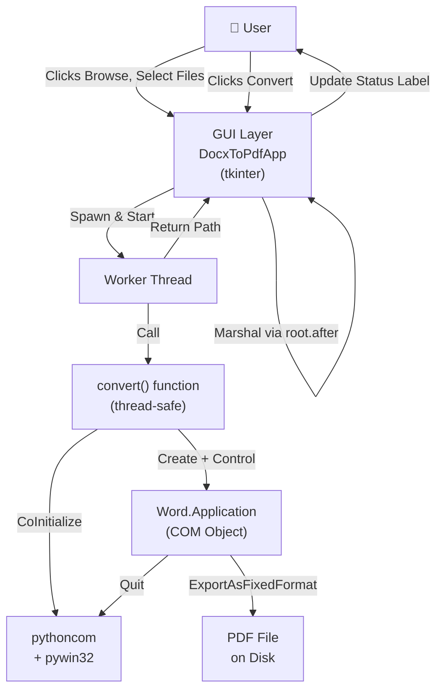

# Architecture

## Component Overview



## Conversion Sequence (Step by Step)

1. **User clicks "Browse"** → `_browse_source()` opens a file dialog.
   - User selects `.docx` or `.doc` file.
   - `src_path` StringVar is updated; output directory defaults to the same folder.
   - "Convert" button becomes enabled.

2. **User clicks "Convert"** → `_on_convert()` is called.
   - Validates that both source and output are selected.
   - Disables all buttons (Browse, Convert) to prevent concurrent conversions.
   - Updates status to "Converting...".
   - Spawns a daemon worker thread and returns immediately.

3. **Worker thread runs `_convert_worker()`**.
   - Calls `convert(src_path, out_dir)` with absolute paths.
   - `convert()` initializes COM on this thread, creates a Word process, opens the document, exports to PDF, and cleans up.
   - On success, returns the full path to the created PDF.
   - On error, raises `FileNotFoundError`, `PermissionError`, or `RuntimeError`.

4. **Back to main thread** (via `root.after()`).
   - Success: status label shows "Created *filename*.pdf" in green.
   - Error: status label shows error message in red.
   - Buttons are re-enabled.

5. **User can convert another document** or close the app.

## Threading Model

### Why Threading?

Word's COM export is **synchronous and blocking**. A large document can take 5–30 seconds to export. Without threading, the GUI would freeze and become unresponsive.

### How It Works

- **Main thread:** tkinter event loop. Responds to button clicks, updates labels.
- **Worker thread:** Calls `convert()`. Blocks until Word completes the export. Does not touch tkinter widgets.
- **Marshaling:** Worker thread uses `root.after(0, callback, arg1, arg2)` to schedule GUI updates on the main thread.
  - `root.after(0, ...)` means "run this at the next opportunity on the main event loop."
  - This is safe and is the canonical pattern for multi-threaded tkinter apps.

### Daemon Thread

The worker thread is created with `daemon=True`. This means:
- If the main thread (event loop) exits, the daemon is killed automatically.
- The app can quit cleanly without waiting for conversion to complete.
- If the user force-quits Word (Task Manager) while conversion is in progress, the `word.Quit()` in finally will fail silently (caught), and the application will recover gracefully on the next use.

## COM Initialization Per-Thread

```python
pythoncom.CoInitialize()
```

Windows COM requires per-thread initialization. Each thread that uses COM must call `CoInitialize()` before making COM calls and `CoUninitialize()` after.

The worker thread does this; the main thread (tkinter) does not use COM, so it does not initialize.

**Why DispatchEx, not Dispatch?**

- `Dispatch("Word.Application")` reuses an existing Word process if one is already running.
- `DispatchEx("Word.Application")` creates a new, separate process every time.
- If the user has Word open with their own documents, we must not interfere with or share that instance.
- DispatchEx isolates our conversion; if something goes wrong, the user's Word session is unaffected.

## Resource Lifecycle

### Opening

1. `win32com.client.DispatchEx("Word.Application")` → launches `WINWORD.EXE` in the background.
2. `word.Documents.Open(src_path, ...)` → loads the document into the Word process model.

### Conversion

- `doc.ExportAsFixedFormat(OutputFileName=pdf_path, ExportFormat=17)` → Word writes the PDF to disk.
  - Format 17 = `wdFormatPDF`, Word's native constant for PDF export.
  - The export is synchronous; the call returns only after the PDF file is written.

### Cleanup (always runs, even on error)

```python
finally:
    if doc is not None:
        try:
            doc.Close(False)  # False = don't save
        except Exception:
            pass
    
    if word is not None:
        try:
            word.Quit()
        except Exception:
            pass
    
    try:
        pythoncom.CoUninitialize()
    except Exception:
        pass
```

**Why finally?** If a COM error occurs mid-conversion, cleanup still runs.

**Why `doc.Close(False)`?** The `False` argument means "do not save the document." Even if the document model has unsaved changes (which it shouldn't, because we opened read-only), they are discarded. This ensures we never modify the user's source file.

**Why catch exceptions in finally?** Cleanup can fail (e.g., if Word is already dead). We do not want a cleanup failure to mask the original exception or crash the error handler.

**Consequence:** If cleanup fails silently, a WINWORD.EXE process *may* remain running. Over many failed conversions, this could exhaust resources. To diagnose: `tasklist /FI "IMAGENAME eq WINWORD.EXE"` lists running Word processes.

## Error Taxonomy

The `convert()` function raises three exception types, each caught and displayed as plain text to the user:

### FileNotFoundError
- Source file does not exist.
- Source path is a directory, not a file.
- Output directory does not exist.
- Output directory is not writable.

**User message:** e.g., "Source file not found: C:\Docs\sermon.docx"

**How GUI handles it:** Displays in red status label.

### PermissionError
- Output directory is not writable (insufficient permissions).
- Output PDF file is locked by another program (open in Adobe Reader, Word, etc.).

**User message:** e.g., "Could not write the PDF. Close it if it's open in another program and try again."

**How GUI handles it:** Displays in red status label.

### RuntimeError
- Microsoft Word is not installed or COM dispatch failed.
- A conversion failed mid-process (corrupted document, unsupported format, etc.).

**User message:** e.g., "Microsoft Word is required but wasn't found." or "Conversion failed: ..."

**How GUI handles it:** Displays in red status label.

### Unexpected Exception
- Any other exception not anticipated.
- This should not happen in normal operation; indicates a bug or severe system issue.

**User message:** "Unexpected error: ..." with the exception message.

**How GUI handles it:** Displays in red status label.

## Packaging & Distribution

### Frozen Executable Layout

The application is packaged with PyInstaller into a single standalone .exe (`dist\DocxToPdf.exe`). When the .exe is launched:

1. PyInstaller's bootloader starts and extracts the bundled Python interpreter, standard library, and application code into a temporary directory (typically `%LOCALAPPDATA%\Temp\`).
2. The bundled `pywin32` library is available in this temporary environment.
3. The application runs normally: COM initialization, Word automation, etc., all work as they do in the source-code version.
4. On exit, PyInstaller cleans up the temporary files.

**First launch takes 1–2 seconds** due to unpacking; subsequent runs within the same session are faster (cached).

### Why Frozen Distribution?

- **No Python required:** End-users do not need to install Python, pywin32, or any dependencies.
- **Polished user experience:** Double-click a Desktop shortcut; the .exe launches with a custom icon and no console window.
- **Single file:** Easier to distribute, move, or delete.

### Building the Executable

See [build.bat](/build.bat) and [CLAUDE.md](CLAUDE.md#packaging--distribution) for details. The build process runs PyInstaller with:
- `--onefile` — Bundle everything into a single .exe.
- `--windowed` — Suppress the console window (essential for desktop-app aesthetics).
- `--icon assets\icon.ico` — Custom icon (16–256 px, multi-resolution).

---

## Why This Architecture?

1. **Separation of concerns:** `convert()` is pure business logic, testable independently. The GUI is a thin wrapper.
2. **Threading for responsiveness:** User never sees a frozen window.
3. **Resource safety:** finally-block cleanup ensures no orphaned Word processes.
4. **COM isolation:** DispatchEx prevents interference with the user's own Word window.
5. **Error clarity:** Three exception types cover all cases; users see plain English, not tracebacks.
